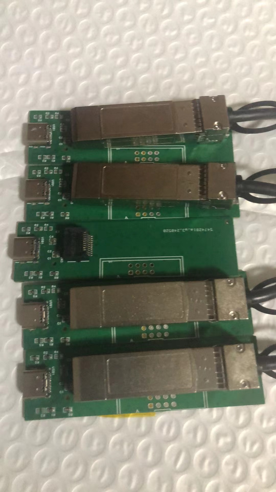

# XLogic Anayzer develolp log

3. 2024/6/10 
  newer version run 
   

2. 2024/5/24
  
  
  
1. 2024/5/10
   gen1x2 speed test done!  
   Loopback speed is 429MB/s !  
   minor bug fixing...  
   see [speed](usb3/speed_result.md)

