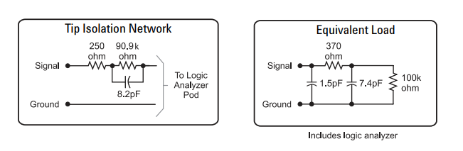
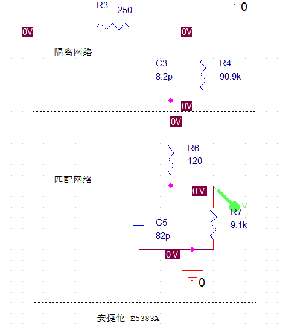
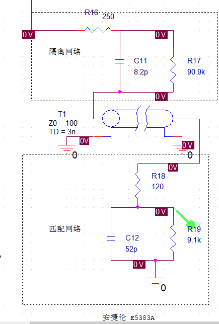
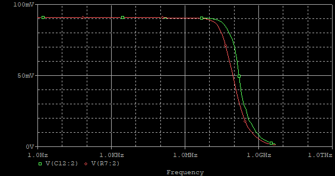
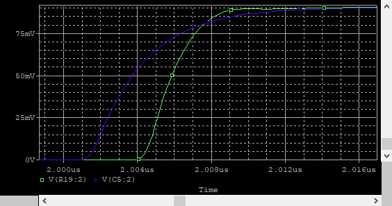
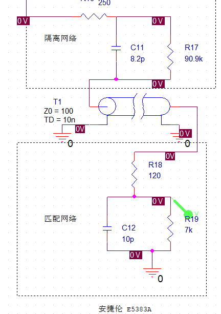
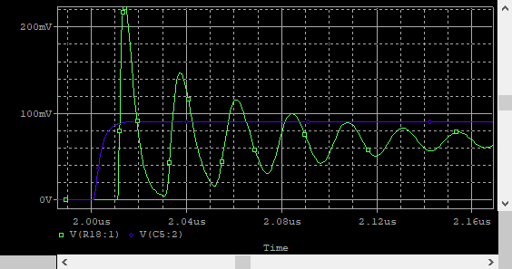
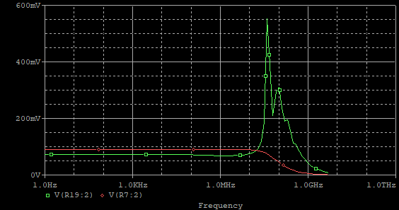

# 逻辑分析仪探头设计
 
## 基本结构
  逻辑分析仪包括3个部分:   
    a. 探头和采样
    b. 数字信号的存储和传输
    c. 分析软件
  探头和采样部分，有如下构成：   
    夹子或者插头----飞线-----传输线-------比较器。 对于简易型的逻辑分析仪，可以没有传输线。

## 目标
  探头和采样部分的目标有两个
  1. 减少对待测电路的影响
     探头以及逻辑分析仪对于被测的影响，可以表征为在某个频率范围内的阻抗特性。
     正如示波器探头一样，最简单的表征为电阻并联电容到地。电阻越大，电容越小代表对被测电路的影响越小。
     下面时安捷伦 E5383A 17-Channel Single-Ended Flying Lead Probe 的等效图：
      
    仿真得到的输入阻抗曲线：
      
    
     
  2. 准确的捕获待测信号
    被测信号经过测试夹飞线传输线到达比较器时，希望信号能够尽可能保持原状。
    看作一个滤波器，则希望通带尽可能宽，同时通带内尽可能平坦。
   
## 设计
   观察安捷伦的隔离网络和等价图。可以按照电阻电容相等的方法设计出内部采样电路。如图
   
   仿真得到的传输函数：
     
       
   仿真得到的一种包含传输线的电路：
   
   仿真得到的传输函数：
 
   仿真得到的阶跃响应：
 

 当传输线较长时,传输函数表现为在 f=1/(2*td)的频率出出现高峰，在时域体现为震铃。这时候匹配变得非常更加困难。  
 这也和直观一致,线越长，能传输的频率越低.
 例如：

 
 
 
