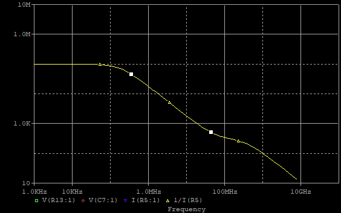
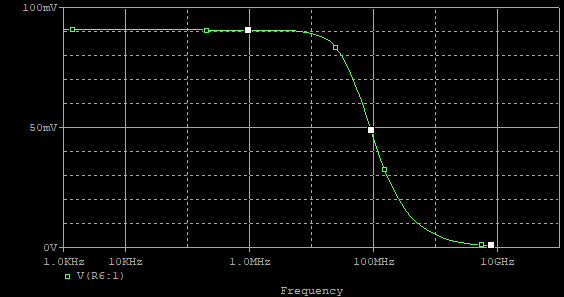

# 逻辑分析仪探头设计
 
## 基本结构
  逻辑分析仪包括3个部分:   
    a. 探头和采样
    b. 数字信号的存储和传输
    c. 分析软件
  探头和采样部分，有如下构成：   
    夹子或者插头----飞线-----传输线-------比较器。 对于简易型的逻辑分析仪，可以没有传输线。

## 目标
  探头和采样部分的目标有两个  
  ### 1. 减少对待测电路的影响  
  探头以及逻辑分析仪对于被测的影响，可以表征为在某个频率范围内的阻抗特性。
  正如示波器探头一样，最简单的表征为电阻并联电容到地。电阻越大，电容越小代表对被测电路的影响越小。
  下面是安捷伦 E5383A 17-Channel Single-Ended Flying Lead Probe 的等效图：  
        
  仿真得到的输入阻抗曲线：  
        
    
     
  ### 2. 准确的捕获待测信号  
  被测信号经过测试夹飞线传输线到达比较器时，希望信号能够尽可能保持原状。
  看作一个滤波器，则希望通带尽可能宽，同时通带内尽可能平坦。
   
## 设计
   观察安捷伦的隔离网络和等价图。可以按照电阻电容相等的方法设计出内部采样电路。如图  
     
   仿真得到的传输函数：  
       
       
   仿真得到的一种包含传输线的电路：  
     
   仿真得到的传输函数：  
   
   仿真得到的阶跃响应：  
   

 当传输线较长时,传输函数表现为在 f=1/(2*td)的频率出出现高峰，在时域体现为震铃。这时候匹配变得更加困难.  
 这也和直观一致,线越长,能传输的频率越低.  
 例如：

   
   
   

## 附注
  ### 1. 测试输入电容、寄生电容
  设计时，采用FPGA作为采用设备。怎么得到FPGA的输入参数呢? 

  第一个方法是查看 FPGA的ibis模型，模型中包含了封装电容 C_pkg 以及 输入模型的 C_comp 二者相加就得到FPGA的输入电容。  
  例如 xc7a35tftg484的C_pkg=1.4pF,C_comp 在5pf-8pf之间。  
  另外系统中还包括了其它器件的寄生电容，就需要用测试的方法。
  
  测试时，首先在逻辑分析仪探头输入1HZ或者几KHZ的方波,然后用示波器测量FPGA的输入。同时条件匹配电阻指到示波器显示平整方波为止，原理和方法与示波器探头条件相同。由于示波器探头有10pf的电容，所以这个方法将大致精确到几pf的数量级。
  这时候可以用probetest.v作为信号源，测量低频信号之后高频信号的占空比变化来确认是否匹配。因为这个方法以最终数字信号作为标准。这个测量精度就已经足够。  

  ### 2. 匹配的精度
  电阻的精度非常高，匹配精度主要取决于电容精度和寄生电容。由于寄生电容一般为几pF,所以采用十几pf以上的电容，将基本不受寄生电容的影响(误差<10%).
    
    

  

  