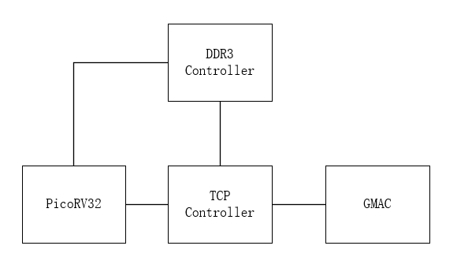
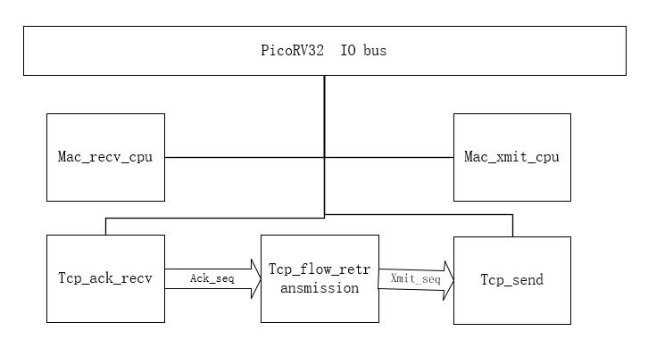

# FPGA上软硬协作的TCP实现
## 目标
   1. 高性能  
   能够实现(接近)满带宽运行
   2. 容易开发维护 
   
   3. 资源占少用
   以上目标按照顺序编号越小，优先级越高。
## 背景  
TCP（Transmission Control Protocol，传输控制协议）是互联网协议栈中广泛使用的一种传输层协议，负责在计算机网络中提供可靠的、面向连接的字节流通信。它与IP（Internet Protocol）协议共同工作，通常称为TCP/IP协议栈的核心部分。
### TCP的主要特点：
 1. 面向连接：在发送数据之前，TCP要求通信双方建立一个逻辑连接。连接的建立通过三次握手（Three-Way Handshake）来完成。
 2. 可靠性：TCP提供可靠的数据传输，确保数据能够按照正确的顺序到达目标，并在传输过程中纠正错误。如果数据在传输过程中丢失，TCP会自动重新发送。
 3. 流量控制：TCP使用滑动窗口机制，根据接收方的处理能力，动态调整发送方的数据发送速度，防止网络拥塞。
 4. 拥塞控制：通过慢启动（Slow Start）、拥塞避免（Congestion Avoidance）等算法，TCP可以检测网络的拥塞情况并进行适应性调整。
 5. 数据完整性：TCP通过校验和机制，确保传输的数据没有被篡改。如果发现数据包损坏，TCP会请求重新传输。
### TCP工作流程：
1. 三次握手（Three-Way Handshake）：
客户端向服务器发送一个SYN（同步）请求，表示想建立连接。
服务器收到请求后，回传SYN-ACK，表示同意建立连接并确认客户端的请求。
客户端收到确认后，再发送ACK，确认收到服务器的回复，连接建立完成。
2. 数据传输：
在建立连接后，客户端和服务器之间开始进行数据传输。数据按序传输，每个数据包都有一个序列号，用来确保接收方能够按照正确的顺序重组数据。
3. 四次挥手（Four-Way Handshake）：
当通信结束时，双方通过四次握手来释放连接，确保所有的数据都已经被成功接收。 
## 实现
### 基本架构

### 软硬件分工
   鉴于TCP的复杂性,本设计采用这样一种原则，凡是不影响性能的部分都由软件实现。  
   具体就是TCP的建立连接，断开连接由软件实现，传输数据由RTL实现。
   TCP连接建立阶段由Picorv32处理，建立起连接后，配置RTL相关寄存器和模板，将数据传输控制权转交给RTL。RTL部分检测到断开连接或者重置连接标志后，控制权重新转交给CPU。
   在将控制权由cpu转移到RTL时，需要从LWIP的tcp状态复制给RTL。转回时，需要反向同步。
### 模块
  1. 框图
     
  2. mac_recv_cpu  
    把gmac接收到的数据保存到内部BlockRam，等待cpu处理。鉴于局域存在大量的广播数据，处理这些广播数据将耗尽CPU处理能力，本模块还实现了包过滤功能，过滤所有不是针对本机ARP查询的广播包。
    鉴于cpu仅用于低速模式的数据，使用了2K字节的缓冲区。
    包过滤器可以配置，正常工作状态为接收本机MAC和针对本机的ARP查询广播包。
  3. mac_xmit_cpu  
    提供发送数据包的功能。本模块使用1k字节的缓冲区。由CPU写入后，发送到GMAC
  4. tcp_ack_recv
    处理gmac接收到的数据包，提取数据报的信息。输出 ack_seqnum_valid,ack_seqnum,tcp_window,tcp_flags_is_fin_rst 信息。    
    本模块使用一个由CPU配置的64(实际TCP使用12+2+40)字节模板,如果模板中的项匹配，而且IP/TCP校验和正确，则提取信息。
  5. tcp_send
    从tcp_flow_retransmission接收需要传输的tcp序列号以及内存地址，读取数据后打包发送给gmac模块。
    本模块也采用模板实现,由cpu配置一个64字节的模板。本模块在发送过程中，修改其中的校验和序列号等信息，然后发送给gmac模块。
  6. tcp_flow_retransmission
    处理从tcp_ack_recv接收过来的ack_seqnum,tcp_window,tcp_flags_is_fin_rst信号，产生 tcp_flow_seq,data_addr给tcp_send模块。
    本模块实现了简单的流控重传机制,而没有处理拥塞控制等。
    本模块的实现算法如下：
    1.  如果ack_seqnum+tcp_window大于当前的tcp_flow_seq,则持续输出tcp_flow_seq。
    2. 连续收到相同的ack_seqnum，则把tcp_flow_seq重置为ack_seqnum。每次从之后会暂停一段时间本功能。理论上需要RTT的时间。本设计简单等待1ms.
    3. 如果长时间没有收到ack_seqnum,则把tcp_flow_seq重置为ack_seqnum。这个超时时间设置为1秒钟。用来应对系统中的偶发错误。

### 细节讨论
  1. TCP/IP校验和
     
  2. 速度
    关于TCP传输速度有如下结论：  
    **窗口大小=系统带宽*往返时间**   
    在本设计使用的局域网设计环境中，经常观察到14us左右的RTT时间。
    所以理想状态TCP window只需要 14us*125MB/s=1750B。
    因此可以完全不需要外部RAM,而全部采用BlockRAM实现。

 具体可以参考
  [Fakernet pdf](https://arxiv.org/abs/2003.12527)   [Fakernet homepage](https://fy.chalmers.se/~f96hajo/fakernet/)
  注意,与本设计不同，fakernet没有使用软硬件分工而是全部采用RTL实现，因此更为复杂。
## 结果
  ### 代码：
``` shell
  wc `ls tcp_*.v` mac_*.v
  266   584 10551 tcp_ack_recv.v
  167   306  4840 tcp_axi_reader.v
  487   870 15019 tcp_flow_retransmission.v
  394   695 12228 tcp_send.v
  260   444  7212 tcp_send_buffer.v
  433   880 15111 mac_recv_cpu.v
  129   236  3880 mac_xmit_cpu.v
  2136  4015 68841 total
``` 
### 资源
|instance |LUT|FF|
|-|-|-|
|u_mac   | 667       | 626       |
|u_mac_recv_cpu| 249 | 162       |
|u_tcp_ack_recv| 195       | 261       |
|u_tcp_flow_retransmission | 517       | 720       |
|u_tcp_send    | 521       | 539       |
|u_udp_send    | 535       | 466       |
|u_mac_xmit_cpu|34        | 31        |

### 速度
  977MBps